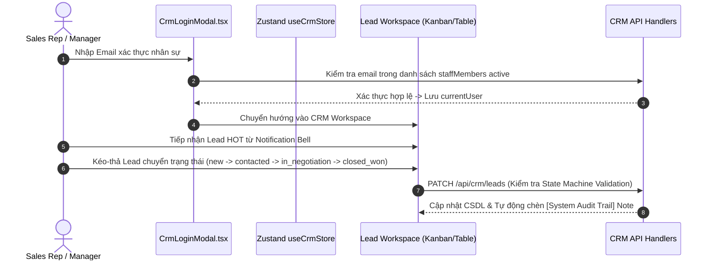

# PRD: Architecture & Feature Specification - Internal CRM Pipeline & Analytics System

> **Tài liệu Yêu cầu Sản phẩm (Product Requirement Document) - Phân hệ CRM**  
> **Phiên bản**: 3.0.0 (Audited Source of Truth Edition)  
> **Mục tiêu**: Chuẩn hóa toàn bộ phân hệ Quản trị CRM Pipeline Thu thập, Chấm điểm, Quản lý Lead, Phân quyền RBAC, Xác thực Nhân sự và Executive Analytics.

---

## 1. Product Overview (Tổng quan Phân hệ CRM)

Phân hệ Quản trị CRM Pipeline System (`src/features/crm` & `src/app/api/crm`) là giải pháp quản lý bán hàng và phân tích hiệu suất kinh doanh cho doanh nghiệp:

- **Tự động hóa Tiếp nhận Lead từ Kênh Kép (Dual-Source Ingestion)**: Tiếp nhận Lead tự động từ Landing Page Modal và hỗ trợ khởi tạo Lead thủ công trực tiếp từ giao diện CRM hoặc Admin API.
- **Lead Auto-Scoring Engine**: Máy chấm điểm tự động (0–100 điểm) phân loại Lead tức thì thành HOT 🔥, WARM ☀️, hoặc COLD ❄️ trên Bộ nhớ RAM (Computed Memory Attributes).
- **Sales Funnel State Machine**: Kiểm soát chặt chẽ luồng chuyển đổi trạng thái bán hàng (`new` $\rightarrow$ `contacted` $\rightarrow$ `in_negotiation` $\rightarrow$ `closed_won` / `closed_lost`), chặn Sales Rep tự ý re-open deal đã đóng và cho phép Manager/Admin override.
- **Xác thực & Quản trị Nhân sự**: Hỗ trợ đăng nhập phân quyền `CrmLoginModal`, trang tùy chỉnh hồ sơ avatar/password `CrmUserSettings`, ma trận phân quyền 3 vai trò (Super Admin, CRM Manager, Sales Rep).
- **Nhật ký Audit Log & Ring Buffer 1k**: Ghi lại 1000 bản ghi thao tác gần nhất với cơ chế SQL Auto-Pruning Ring Buffer tự động dọn dẹp dữ liệu cũ.
- **Executive Analytics Engine**: Báo cáo tài chính cấp cao bao gồm Tỷ lệ Chuyển đổi Số ($DCR\%$), Doanh thu Thực nhận, và Ma trận Dòng tiền Lợi nhuận ($35\%$ Margin).

---

## 2. Target Users (Đối tượng Sử dụng CRM)

| Vai trò (Role) | Mô tả & Nhu cầu | Quyền hạn & Phạm vi Tương tác |
| :--- | :--- | :--- |
| **Super Admin (Cấp điều hành)** | Chủ doanh nghiệp, Giám đốc. Nhu cầu giám sát hiệu suất Sales, doanh thu, lợi nhuận gộp $35\%$ và quản lý toàn bộ nhân sự hệ thống. | Toàn quyền CRM, xem Executive Analytics, quản lý RBAC Matrix, xem & dọn dẹp Audit Logs, re-open deal đã đóng. |
| **CRM Manager (Quản lý Kinh doanh)** | Trưởng phòng Sales. Nhu cầu phân bổ Lead, giám sát tiến độ chốt deal và can thiệp quy trình bán hàng. | Quản lý Kanban/Table Lead Workspace, thay đổi trạng thái Lead, re-open deal đã đóng, tạo Lead thủ công, xuất báo cáo CSV. |
| **Sales Rep (Nhân viên Bán hàng)** | Nhân viên Sales. Nhu cầu đăng nhập hệ thống, nhận cảnh báo HOT Lead, chăm sóc khách hàng, cập nhật ghi chú và hồ sơ cá nhân. | Đăng nhập qua `CrmLoginModal`, tiếp nhận Lead, cập nhật tiến độ Funnel (chặn re-open khi đã closed), thêm Notes, đổi avatar/password tại `CrmUserSettings`. |

---

## 3. Core Problems Solved (Vấn đề Cốt lõi Giải quyết)

1. **Thất thoát & Trễ hạn Xử lý Lead Inbound**: Lead từ Landing Page không được lưu trữ và thông báo ngay cho đội ngũ sales.
2. **Sàng lọc & Phân loại Lead Thủ công**: Sales mất thời gian phân loại dữ liệu thay vì tập trung vào các lead doanh nghiệp lớn.
3. **Phá vỡ Quy trình Bán hàng**: Nhân viên tự ý chuyển trạng thái hoặc thay đổi kết quả chốt hợp đồng mà không có kiểm soát.
4. **Phá vỡ Kiểm soát Phân quyền (RBAC)**: Nhân sự truy cập hoặc thao tác vượt quá thẩm quyền cho phép.
5. **Thiếu Báo cáo Tài chính Real-time**: Không kết nối được số lượng inbound lead với doanh thu thực nhận và dòng tiền lợi nhuận gộp thực tế.

---

## 4. Product Goals & Non-Goals (Mục tiêu & Phạm vi CRM)

### Product Goals
- **Tự động hóa 100% Thu thập & Chấm điểm Lead**: Mọi Lead từ Landing Page hoặc tạo thủ công đều qua Scoring Engine chấm 0–100 điểm.
- **Xác thực & Tùy chỉnh Hồ sơ Nhân sự**: Hỗ trợ đăng nhập `CrmLoginModal` và trang tùy chỉnh avatar/password `CrmUserSettings`.
- **Bảo mật State Machine Enforcement**: Khóa quy trình bán hàng, chỉ cho phép Manager/Admin re-open deal đã chốt.
- **Tối ưu Báo cáo Ring Buffer**: Giới hạn 1.000 bản ghi Audit Log giữ câu truy vấn SQL luôn $<10\text{ms}$.
- **Độ phủ Kiểm thử (Test Coverage)**: 100% Pass test suite cho Scoring Engine, State Machine, Analytics Math và Audit Ring Buffer.

### Non-Goals
- Không xây dựng phần mềm kế toán chuyên sâu (chỉ tính toán Lợi nhuận gộp $35\%$ và Dòng tiền dự báo).
- Không tích hợp trình gửi Email Marketing hàng loạt.

---

## 5. User Journeys (Hành trình Sử dụng CRM)

---

## 6. Success Metrics (Chỉ số Thành công CRM)

- **Tỷ lệ Chuyển đổi Số (Digital Conversion Rate - DCR)**: $\ge 15\%$ Lead đầu vào chuyển đổi thành `closed_won`.
- **Tốc độ Phản hồi API CRM**: Phản hồi API REST $< 150\text{ms}$.
- **Độ chính xác Kiểm thử**: 100% Test pass cho cả 4 bộ test suite (`calculateLeadScore`, `lead-state-machine`, `analytics-math`, `audit-log`).
