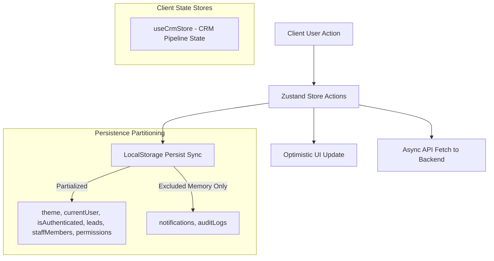

# DESIGN: UI/UX, Logic & State Handling Specification - Internal CRM System

> **Tài liệu Giao diện, Logic & Quản lý Trạng thái - Phân hệ CRM**  
> **Phiên bản**: 3.0.0 (Audited Source of Truth Edition)  
> **Mục tiêu**: Chuẩn hóa toàn bộ thiết kế giao diện CRM, cấu trúc Layout Shell, các trang quản trị nhân sự, và kiến trúc State Management (Zustand).

---

## 1. CRM Layout Shell & Navigation Specs

### A. Layout Shell (`CrmHeader.tsx`, `CrmSidebar.tsx`)
1. **Header Component**:
   - Hiển thị Tiêu đề Màn hình, Theme Toggle (Light/Dark Mode), Test Role Switcher.
   - **Notification Center Bell Dropdown**: Hiển thị Biểu tượng Chuông kèm Badge đếm thông báo chưa đọc, hỗ trợ `Dismiss` xóa từng item và `Clear All` xóa toàn bộ thông báo.
2. **Sidebar Component**:
   - Điều hướng 4 mục chính: Lead Workspace, Executive Analytics (`super_admin` duy nhất), Team & RBAC Matrix, Audit Logs.
   - Profile Card hiển thị Avatar, Họ tên, Role badge hiện tại và Nút Logout.

### B. Staff Login Modal (`CrmLoginModal.tsx`)
- Màn hình Modal cố định trung tâm (`fixed inset-0 z-50 bg-black/90`).
- Chứa Logo KTD Team, Input Email (`admin@company.com`), Input Password.
- Nút "Đăng Nhập Hệ Thống" gọi `login(email)`. Nếu không thành công $\rightarrow$ Hiển thị Alert đỏ thông báo tài khoản bị khóa/không tồn tại.

### C. Account & Profile Settings (`CrmUserSettings.tsx`)
- Giao diện tùy chỉnh thông tin tài khoản nhân sự:
  - **Avatar Selection**: Lưới 6 ảnh Avatar có sẵn (`PRESET_AVATARS`) + Trường URL ảnh tùy chỉnh.
  - **Full Name Field**: Hiển thị tên nhân sự kèm Badge `System Field` bị khóa chỉnh sửa (Read-only).
  - **Email Field**: Cho phép chỉnh sửa email làm việc.
  - **Password Fields**: Ô "New Password" và "Confirm New Password". Nếu không trùng khớp $\rightarrow$ Cảnh báo lỗi.
  - **Buttons**: Nút "Cancel Changes" khôi phục dữ liệu cũ và nút "Save Profile Changes" đồng bộ CSDL.

---

## 2. State Handling & Client Persistence Architecture

### Zustand Stores & LocalStorage Persistence

- **Persistence Storage Key**: `vlsc_crm_storage`.
- **Hydration Memory Computed Attributes**: 2 trường `score` và `scoreCategory` KHÔNG lưu cứng trong CSDL mà được tính toán trên bộ nhớ RAM bởi `calculateLeadScore()` khi fetch dữ liệu về Store.

---

## 3. Executive Reporting & Mathematical Formulas

### A. Digital Conversion Rate (Tỷ lệ Chuyển đổi Số)
$$\text{Digital Conversion Rate (\%)} = \begin{cases} 
\left( \frac{\text{Total Closed Won Leads}}{\text{Total Inbound Leads}} \right) \times 100\% & \text{nếu Total Inbound Leads} > 0 \\
0.0\% & \text{nếu Total Inbound Leads} = 0
\end{cases}$$

### B. Realized Profit Cash Flow Matrix (Ma trận Dòng tiền Lợi nhuận Thực tế)
- **Doanh thu Thực nhận (Realized Cash Flow)**: Tổng `dealValue` của tất cả Lead có trạng thái `closed_won`.
- **Lợi nhuận Gộp Ước tính (Realized Profit)**: $\text{Realized Profit} = \text{Realized Cash Flow} \times 35\%$.
- **Doanh thu Dự báo (Pipeline Forecast)**: $\text{Forecast Revenue} = \text{Realized Cash Flow} + (\text{In Negotiation Value} \times 50\%)$.
