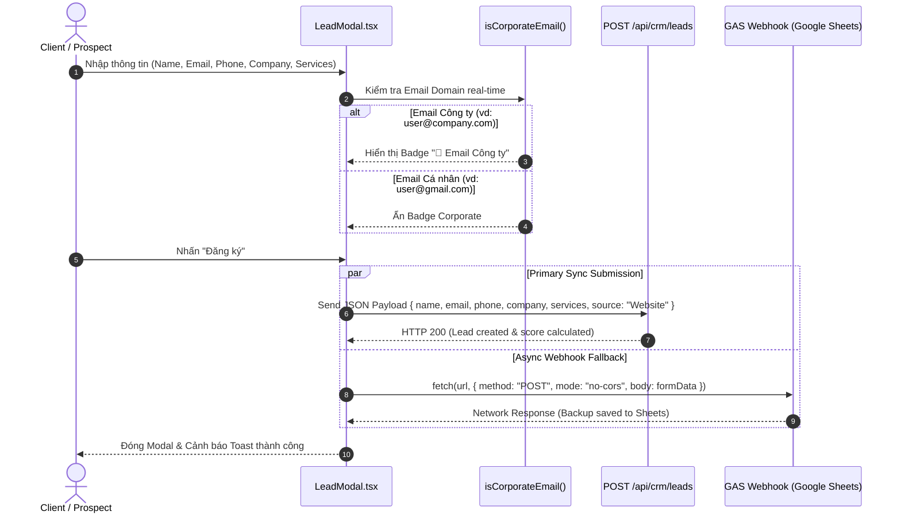

# ARCHITECTURE: System Architecture & Data Flow - Public Inbound Landing Page

> **Tài liệu Kiến trúc Hệ thống & Luồng Dữ liệu - Phân hệ Landing Page**  
> **Phiên bản**: 3.0.0 (Audited Source of Truth Edition)  
> **Mục tiêu**: Định nghĩa toàn bộ kiến trúc giao diện 3D WebGL, cuộn mượt Lenis, cấu trúc mô-đun và cầu nối tích hợp dữ liệu Inbound Lead.

---

## 1. Landing Page Architecture Overview (Tổng quan Kiến trúc Landing Page)

```mermaid
graph TD
    subgraph Client Presentation Layer (Landing Page UI Engine)
        Page[app/page.tsx - Home Page Route]
        Scene3D[shared/components/Scene3D.tsx - Three.js WebGL Particle Canvas]
        LenisScroll[shared/components/SmoothScroll.tsx - Lenis Inertial Scroll]
        ScrollProgress[features/landing/ui/ScrollProgressBar.tsx]
        LoadingScreen[features/landing/ui/LoadingScreen.tsx]
        Navbar[features/landing/ui/Navbar.tsx]
        ModalUI[features/landing/ui/LeadModal.tsx]
        
        subgraph 10 Content Sections
            Hero[HeroSection.tsx & Terminal.tsx]
            Trust[TrustBySection.tsx]
            Tech[TechStackSection.tsx]
            About[AboutSection.tsx]
            Stats[StatsSection.tsx]
            Exp[ExperienceSection.tsx]
            Projects[ProjectsSection.tsx & TiltCard.tsx]
            Testimonials[TestimonialsSection.tsx]
            FAQ[FAQSection.tsx]
            Contact[ContactSection.tsx]
        end
    end

    subgraph State Management (Client Memory)
        ModalStore[shared/store/useModalStore.ts]
        LoadingStore[shared/store/useLoadingStore.ts]
    end

    subgraph External Bridge & Data Sinks
        CRM_API[API Endpoint: POST /api/crm/leads]
        GAS_Webhook[Google Apps Script Async Webhook / Google Sheets]
    end

    Page --> Scene3D
    Page --> LenisScroll
    LenisScroll --> ScrollProgress
    LenisScroll --> LoadingScreen
    LenisScroll --> Navbar
    LenisScroll --> Hero
    LenisScroll --> Trust
    LenisScroll --> Tech
    LenisScroll --> About
    LenisScroll --> Stats
    LenisScroll --> Exp
    LenisScroll --> Projects
    LenisScroll --> Testimonials
    LenisScroll --> FAQ
    LenisScroll --> Contact
    
    Navbar -->|Trigger Open| ModalStore
    Hero -->|Trigger Open| ModalStore
    Contact -->|Trigger Open| ModalStore
    ModalStore --> ModalUI
    
    ModalUI -->|1. Submit Lead JSON| CRM_API
    ModalUI -->|2. Async Backup no-cors| GAS_Webhook
```

---

## 2. Directory Structure & Module Breakdown (Cấu trúc Mô-đun Landing Page)

```text
src/
├── app/
│   ├── layout.tsx              # Root Layout
│   └── page.tsx                # Public Landing Page Route (/)
├── features/
│   └── landing/                # Landing Page Domain Module
│       ├── components/         # 10 Content Sections
│       │   ├── AboutSection.tsx
│       │   ├── ContactSection.tsx
│       │   ├── ExperienceSection.tsx
│       │   ├── FAQSection.tsx
│       │   ├── HeroSection.tsx
│       │   ├── ProjectsSection.tsx
│       │   ├── StatsSection.tsx
│       │   ├── TechStackSection.tsx
│       │   ├── TestimonialsSection.tsx
│       │   └── TrustBySection.tsx
│       └── ui/                 # Landing Page UI Primitives
│           ├── AnimatedParagraph.tsx
│           ├── BlurText.tsx
│           ├── LeadModal.tsx   # Inbound Lead Form & Email Domain Detector
│           ├── LoadingScreen.tsx
│           ├── MagneticButton.tsx
│           ├── Navbar.tsx      # Navigation Bar & CTA Button
│           ├── ScrambleText.tsx
│           ├── ScrollProgressBar.tsx
│           ├── ShimmerButton.tsx
│           ├── Terminal.tsx
│           ├── TextReveal.tsx
│           └── TiltCard.tsx    # 3D Interactive Project Card
└── shared/
    ├── components/
    │   ├── Scene3D.tsx         # Three.js 3D WebGL Particle Field
    │   └── SmoothScroll.tsx    # Lenis Inertial Smooth Scroll Wrapper
    ├── store/
    │   ├── useLoadingStore.ts  # Loading Screen State
    │   └── useModalStore.ts    # Lead Capture Modal State
    └── utils/
        └── utils.ts            # clsx & tailwind-merge helper
```

---

## 3. Component Hierarchy & Data Flow (Thứ tự Linh kiện & Luồng Dữ liệu)

1. **Thành phần Khung Cố định (Fixed Viewport Layer)**:
   - `Scene3D.tsx`: Thẻ `<canvas>` Three.js cố định toàn màn hình (`z-0 pointer-events-none`).
   - `ScrollProgressBar.tsx`: Thanh tiến trình cố định đỉnh màn hình (`fixed top-0 z-50 h-1 bg-amber-500`).
   - `LoadingScreen.tsx`: Màn hình phủ toàn bộ viewport (`z-[100]`), tự động ẩn khi nạp xong trang (`useLoadingStore`).
   - `Navbar.tsx`: Thanh điều hướng mờ kính (`backdrop-blur-md sticky top-0 z-50`), chứa liên kết cuộn mượt và nút CTA mở Modal.

2. **Thành phần Nội dung 10 Sections (Scroll Content Layer - `z-10 relative`)**:
   - `HeroSection`: Chứa `BlurText`, `TextReveal`, `ShimmerButton` và `Terminal.tsx`.
   - `TrustBySection`: Carousel/lưới logo đối tác.
   - `TechStackSection`: Lưới phân loại kỹ thuật Frontend, Backend, Database, Cloud.
   - `AboutSection` & `StatsSection`: Giới thiệu doanh nghiệp và 4 thẻ thống kê chỉ số ấn tượng.
   - `ExperienceSection`: Timeline mốc lịch sử phát triển.
   - `ProjectsSection`: Danh mục dự án tiêu biểu tích hợp hiệu ứng nghiêng `TiltCard.tsx`.
   - `TestimonialsSection`: Đánh giá trích dẫn từ khách hàng.
   - `FAQSection`: Danh sách câu hỏi accordion toggles.
   - `ContactSection`: Khối liên hệ trực tiếp và nút CTA nộp form.

---

## 4. Integration Bridge: Dual Lead Ingestion Flow (Cầu nối Thu thập Lead)

`LeadModal.tsx` đóng vai trò là cầu nối thu thập thông tin giữa Landing Page và hệ thống CRM:


