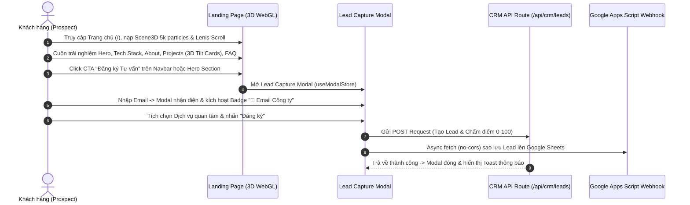

# PRD: Architecture & Feature Specification - Public Inbound Showcase Landing Page

> **Tài liệu Yêu cầu Sản phẩm (Product Requirement Document) - Phân hệ Landing Page**  
> **Phiên bản**: 3.0.0 (Audited Source of Truth Edition)  
> **Mục tiêu**: Chuẩn hóa toàn bộ phân hệ Public Inbound Landing Page Giới thiệu Dịch vụ & Portfolio Tương tác 3D WebGL.

---

## 1. Product Overview (Tổng quan Phân hệ Landing Page)

Phân hệ Public Showcase (Inbound Landing Page - `src/features/landing` & `src/shared`) là bộ mặt thương hiệu của doanh nghiệp, cung cấp trải nghiệm số tương tác cao cấp cho đối tác và khách hàng:

- **Giao diện Giới thiệu Thương hiệu & Năng lực**: Trình bày danh mục dự án tiêu biểu (Selected Works), năng lực kỹ thuật, quy trình làm việc và mạng lưới đối tác tin tưởng.
- **Trải nghiệm 3D WebGL & Micro-animations**: Nền 3D Particle Field bằng Three.js (`@react-three/fiber`), cuộn mượt quán tính Lenis Smooth Scroll, 3D Hover Tilt Cards, hiệu ứng BlurText, ScrambleText và TextReveal.
- **Tối ưu hóa Chuyển đổi Inbound (Lead Generation)**: Khung 10 Section nội dung chuyên sâu tích hợp thanh tiến trình cuộn (`ScrollProgressBar`), màn hình chờ (`LoadingScreen`), và Lead Capture Modal (`LeadModal.tsx`) với khả năng nhận diện Email Công ty thời gian thực và sao lưu kép (Dual Webhook).

---

## 2. Target Users (Đối tượng Sử dụng)

| Vai trò (Role) | Mô tả & Nhu cầu | Quyền hạn & Phạm vi Tương tác |
| :--- | :--- | :--- |
| **Prospect / Client (Khách hàng Tiềm năng)** | Khách hàng B2B/B2C ghé thăm trang web cần tìm hiểu năng lực doanh nghiệp, trải nghiệm Portfolio 3D và gửi yêu cầu báo giá/tư vấn. | Duyệt 10 Section Landing Page, tương tác với nền 3D WebGL, mở Lead Capture Modal và gửi thông tin tư vấn. |
| **Partner / Investor (Đối tác & Nhà đầu tư)** | Đánh giá uy tín thương hiệu, thông số kinh nghiệm và danh mục công nghệ kỹ thuật (Tech Stack). | Khám phá các phần TrustBy, Stats, Experience Timeline và FAQ Section. |

---

## 3. Core Problems Solved (Vấn đề Cốt lõi Giải quyết)

1. **Giao diện Truyền thống Đơn điệu**: Các trang giới thiệu tĩnh không tạo được hiệu ứng thị giác ấn tượng, dẫn đến tỷ lệ thoát trang cao (Bounce Rate).
2. **Trải nghiệm Cuộn & Tương tác Kém Mượt**: Cuộn chuột giật lag và thiếu phản hồi thị giác khi di chuyển qua các section.
3. **Form Đăng ký Phức tạp & Rào cản Chuyển đổi**: Khách hàng ngại điền form dài hoặc thiếu phản hồi trực quan khi điền Email Công ty.
4. **Rủi ro Mất Lead do Lỗi Mạng**: Gửi form truyền thống dễ thất thoát nếu API server gián đoạn (giải quyết bằng Dual Webhook Fallback sang Google Sheets).

---

## 4. Product Goals & Non-Goals (Mục tiêu & Phạm vi)

### Product Goals
- **Trải nghiệm 3D WebGL Cao cấp**: Triển khai 10 Section mượt mà tích hợp nền 3D Particle Field (`Scene3D.tsx`) 5.000 hạt xoay mượt ở $\ge 60\text{fps}$.
- **Tối ưu hóa Điểm số Performance**: Google Lighthouse Performance score $\ge 90$, 0 Cumulative Layout Shift (CLS = 0).
- **Tự động hóa Nhận diện Email Công ty**: Tự động phát hiện domain email doanh nghiệp và hiển thị badge `🏢 Email Công ty` ngay trên UI.
- **Sao lưu Dữ liệu Kép (Dual Webhook Fallback)**: Đồng thời đẩy dữ liệu về CRM API (`/api/crm/leads`) và sao lưu ngầm bất đồng bộ tới Google Apps Script Webhook.

### Non-Goals
- Không xây dựng trình quản lý bài viết CMS động (Landing Page tập trung vào Portfolio & Inbound Lead Generation).
- Không tích hợp trình thanh toán e-commerce trực tiếp trên Landing Page.

---

## 5. User Journey (Hành trình Người dùng trên Landing Page)

---

## 6. Success Metrics (Chỉ số Thành công)

- **Tỷ lệ Chuyển đổi Form Landing Page**: $\ge 5\%$ lượt ghé thăm thực hiện click CTA nộp Form.
- **Tốc độ Khung hình 3D**: $\ge 60\text{fps}$ trên cả Desktop và thiết bị di động.
- **Điểm số Lighthouse Performance**: $\ge 90$ điểm.
- **CLS (Cumulative Layout Shift)**: $0.0$.
